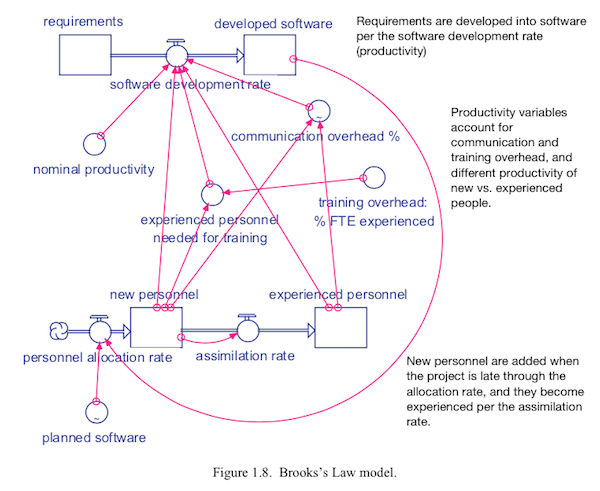

# Automated Software Engineering

**NCSU, Fall 2015**

**Topics:** AI and software engineering; principles of model-based reasoning with a heavy focus on models about software engineering; search-based and evolutionary inference; representing and reasoning about models; handling uncertainty; decision making and model-based reasoning.

**Project:** 700-level students will implement and reason about a large model of their own choosing (ideally, some model relating to software engineering). Optionally, 500-level students may also elect to do so.

**Prerequisite:** A programming background is required in a contemporary language such as Java or C/C++ or Python. Students in this class will work in Python, but no background knowledge of that language will be assumed

# Why take this Subject?

## For your career

**Be Ahead of the Curve!:** What is the next "big thing" after "big data"? Well, after "data collection" comes "model construction" so the next big thing after big data will be "big modeling". In this subject, students will learn how to represent, execute, and reason about models. Our case studies will come from software engineering but the principles of this subject could be applied to models in general.

**Be More Agile:**
Humans learn best (and  fastest) via feedback from direct feedback from the domain. That is is true of agile software development as well as something else I want to call _agile science_:

+ The agile scientists tackles problems at a much higher level than a programmer. 
+ While agile programmers debug string functions, agile scientists debug theories. 

As such, the agile scientist tests ideas more and changes their mind more as they evolve a better undestandng of some phenomenon.

**Be a Better Scientist:**
This subject will teach you a **lot** about empirical methods and how to sample and test complex phenomena. So it is a great place to hone your skills as a scientist.

**Be a Stats Guru**:
More specifically, we will spend much effort on practical, fast, large scale statistical methods. 

**Be employed!! For decades to come!!:**
This subject will make you  be the world's greatest Python programmer.  And that is no bad thing:

But also, this subject could also help you stay ahead of the game for decades to come.
This subject is a bet on the future of SE. 

+ In  traditional manual software engineering, engineers laboriously convert (by hand) non-executable paper models into executable code. 
+ This subject  is about a new kind of SE which relies, at least in part, on executable models. 
   In this approach, engineers codify the current understanding of the domain into a model, 
  and then study those models. 

Many of these new SE models are delivered as part of working systems.
Those  models now
  mediate nearly all aspects of our lives:

+ If you
  live in London or New York and need to call an
  ambulance, that ambulance is waiting for your call
  at a location pre-determined by a model. 
+ If you cross from Mexico to Arizona,
a biometrics model  decides if you need
secondary screening.
+  The power to make your toast comes from a
  generator that was spun-up in response
  to some model predicting your future electrical
  demands.
+ If you fly a plane, extensive
  model-based software controls many aspects of
  flight, including what to do in emergency
  situations.
+ If you have a heart attack, the
   models in the defibrillator will
  decide how to shock your heart and lungs so that
  you might live a little longer.

Given recent advances in computing hardware, software analysts either validate these models or 
find optimal solutions by using automatic tools to explore thousands to millions of inputs for their systems. 
Note that such tools work much faster  than humans.  Without automated tools, it can take days for human experts to review just a few dozen examples.  
In that same time, an automatic tool can explore thousands to millions to billions more solutions.  

This has implications of changing the nature of human exploration of the world around them. As Philip Jia Guo says in his [Ph.D.  dissertation](http://purl.stanford.edu/mb510fs4943):

<em>People across a diverse range of science, engineering, and business-related disciplines
spend their workdays writing, executing, debugging, and interpreting the outputs
of computer programs. Here are some examples of research programming:

+ _Science:_ Computational scientists in fields ranging from bioinformatics to neuroscience
write programs to analyze data sets and make scientific discoveries.
+ _Engineering:_ Engineers perform experiments to optimize the efficacy of machine
learning algorithms by testing on data sets, adjusting their code, tuning
execution parameters, and graphing the resulting performance characteristics.
+ _Business:_ Web marketing analysts write programs to analyze clickstream data
to decide how to improve sales and marketing strategies.
+ _Finance:_ Algorithmic traders write programs to prototype and simulate experimental
trading strategies on financial data.
+ _Public policy:_ Analysts write programs to mine U.S. Census and labor statistics
data to predict the merits of proposed government policies.
+ _Data-driven journalism:_ Journalists write programs to analyze economic
data and make information visualizations to publish alongside their news stories.</em>

In one form of the above the research scientist builds and explores models-- which can be a complex process that this subject aims to simplify.

## Study This Subject to Blow Your Mind

This subject is about two amazing ideas.
After completing this subject, your view of the world will be radically different. Promise.

**Evolutionary-based Computing:**
The main tool discussed in this sibject  algorithms that explore (and sometimes combines) multiple randomly selected solutions to a program. Such evolutionary methods are very cool indeed. In 2012, the website Edge.org asked noted scientists the following question:

+ [What is your favorite deep, elegant, or beautiful explanation?](http://edge.org/responses/what-is-your-favorite-deep-elegant-or-beautiful-explanation)

They received dozens of answers and fully a third of those responses related to evolution and natural selection. The reason was clear- in terms of requiring the least machinery and explaining the most observations, hands down, evolution is the theory of the last 200 years.

What you get with this simple approach is quite a lot. With this kind of computation, you get:

+ Simple implementation: lots and lots of small devices;
+ Easy, coarse-grain co-ordination of effort;
+ Distributed computation, which can be parallelized;
+ Robust networks: that can survive attack and insult and death of some large percent of the network;
+ Adaptability and the generation of new ideas that have not been explored before;

What else offers so much from so little? So one reason to explore search-based SE is that it an explanation of an powerful engineering principle that has had (and will continue to have) a massive impact on this planet.

**Data Mining and Optimization:**
The more I code search algorothm and data miners, the more the code base becomes similar. Its like, under the hood, these things actually do the same thing. 

Now this is not a new insight. Much prior work has commented on the profound connection between data mining and optimization. Both discover then summarize interesting regions of the data. Optimizers can then resample from that region to create new data (while data miners may have to stop at that point since there are gaps between its training data).

But what I think we are close too is a unification of data mining and optimization into one higher-level framework that will simplify both approaches. I think. Maybe. Come help me bumble around on this one and tell me what you think.

